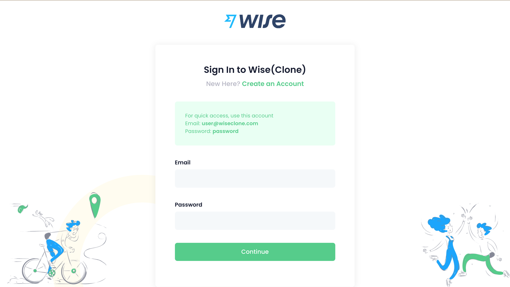
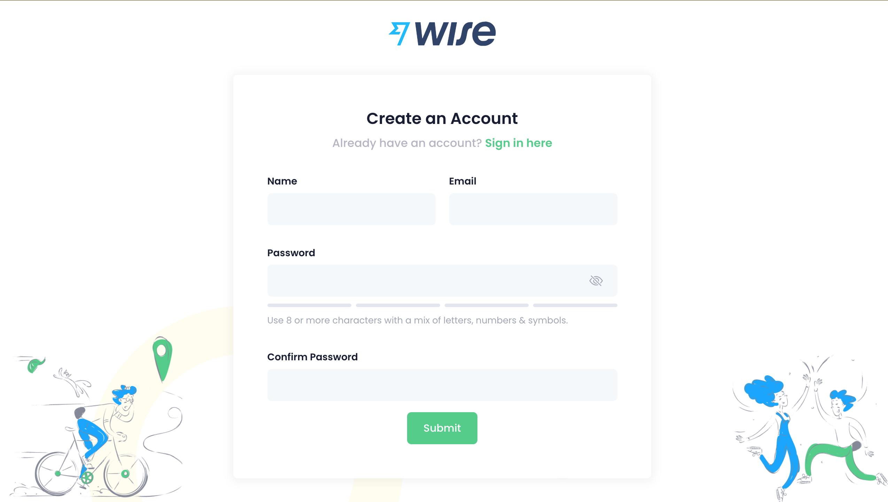
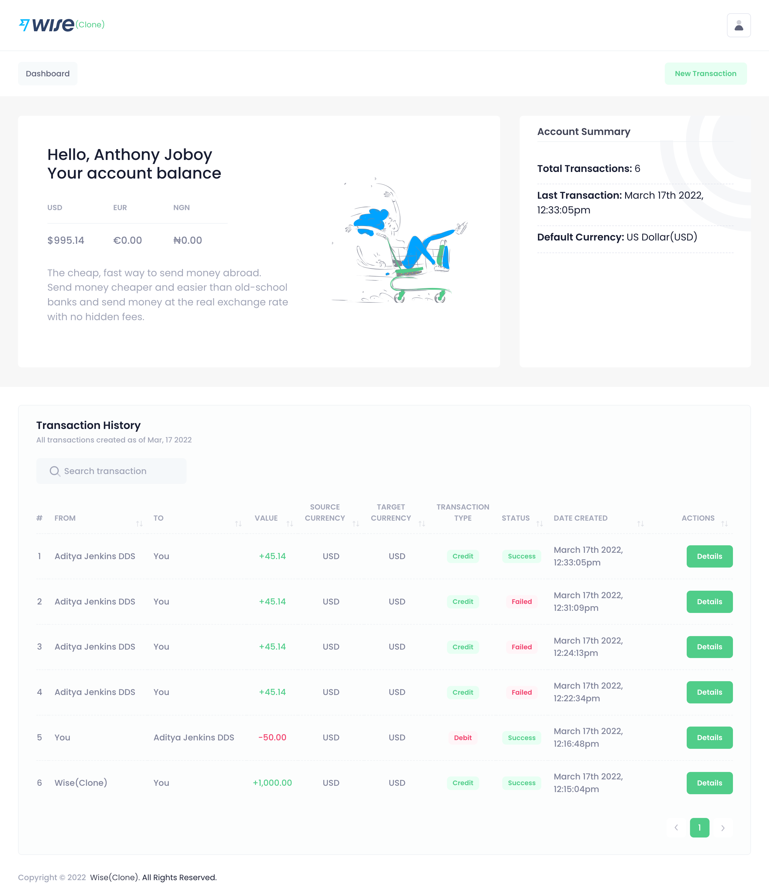
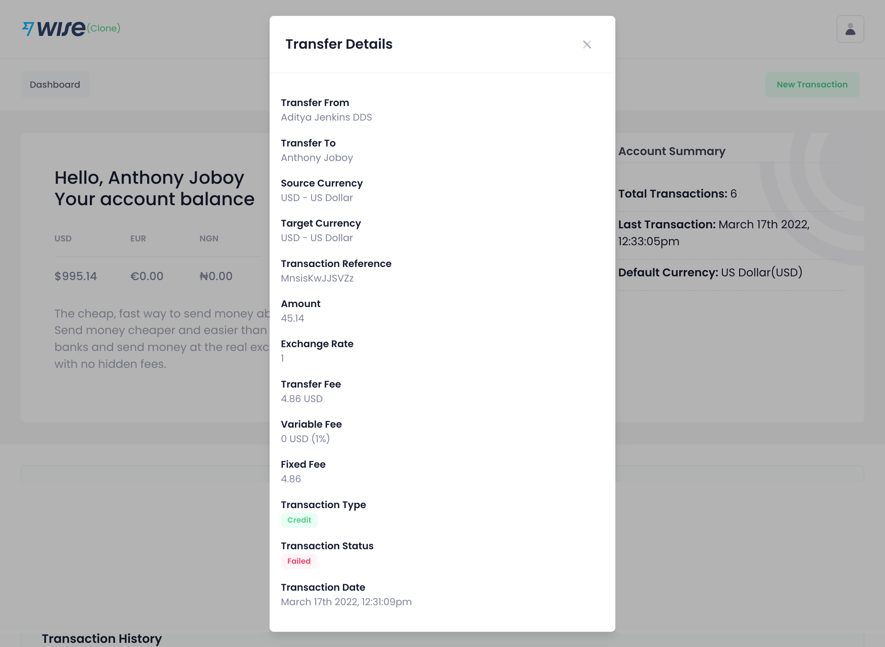
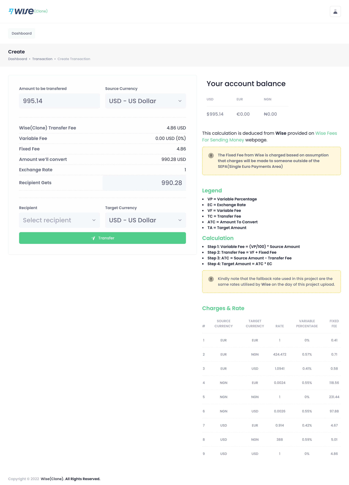

#  Wise Flask (MVP)

In order to gain practical experience building web applications from scratch, this project was developed. The task is to develop a web application that allows users to send virtual money to each other in their choice of currencies (USD, EUR, or local currency).


## Project Benefits
This project should give us a good understanding of:

- How well you can go from text to code, from requirements to product.
- How well you can execute on predefined requirements.
- How well do you pay attention to detail so we can rely on you to execute the work end to end.
- How creatively you execute on vague requirements (that haven't been defined in great detail).
- How well can you hack, organize, document, test, structure, and write your code.
- How well you can leverage existing things to build this app fast.

## About Wise Flask (MVP)

[Wise](https://www.wise.com) allows you to transfer money abroad easily and quickly with low-cost money transfers. You can send money at the real exchange rate with no hidden fees. This web application features the following:

1. A login page.
2. A registration page.
3. A dashboard page, where transactions will be listed.
4. A transaction page.
5. API integration to get current exchange rate from [Free Currency Converter API](https://www.currencyconverterapi.com/) or any other free currency converter or a hand-coded list of exchange rates.
6. A method to record failed transactions following the `ACID` database transaction principle.
7. A feature to refund the dollar account once it is completely exhausted.

## Features

- Money can be sent/converted into any of the three currencies to be sent to another user.
- Money can be sent/converted to any and every user who is registered on the app.
- The user to send the money to can be chosen from an input-dropdown list which shows all users if clicked on. (Tip: Create at least two users as dummy data.)
- A user cannot have a negative balance. All users start with 1000 USD worth of money given via an initial transaction when you create them.
- All users start with USD as their native currency but can receive EUR and your specified local currency.
- All database tables must have the `created_at` timestamp, which should be populated automatically.

## Development Stacks
Our development stack will include the following:

- HTML5
- CSS
- Bootstrap 4
- JavaScript/jQuery
- Python3
- Flask
- PostgreSQL
- Venv(optional)
- Docker(optional)

## Project Files Structure

  ```sh
  ├── .env => To store consume secrets from a local environment
  ├── images => Folder to store screenshots of the finished project.
  ├── README.md
  ├── app.py => the main driver of the app. Includes your SQLAlchemy models. `python app.py` to run after installing dependencies
  ├── config.py => Database URLs, CSRF generation, etc
  ├── forms.py => Your forms
  ├── models.py => To manage your database tables and migrations
  ├── requirements.txt => The dependencies we need to install with `pip3 install -r requirements.txt`
  ├── static
  │   ├── css 
  │   ├── fonts
  │   ├── img
  │   ├── js
  │   └── vendor
  └── templates
      ├── errors
      ├── forms
      ├── layouts
      └── pages
  ```

## Templating

A bootstrap 4(`unify-admin-template`) template has been provided for fast designs, if you choose to use a different template or you want create all of your pages from scratch, please feel free to do so.

- Unzip the `unify-admin-template.zip` file.
- Rename the zipped folder from `design-1` to `templates`. By default, Jinja2 will automatically locate HTML documents from the templates folder.
- Delete all HTML documents from the templates folder, excluding `login.html`, `signup.html`, `index-2.html`, `error404.html`, and `error505.html`. These files will help you in designing the pages as stated in the [About Wise Flask (MVP)](#about-wise-flask-mvp) section, but if you find other pages useful for your own design concepts, go ahead and use them.
- Create a new folder titled `static` and move the folders in the templates folder to it. [Review the project structure](#project-files-structure).
  
## Git Instructions

When you start developing, commit all of your work on a topic branch:

- Before merging with the main branch
- Make sure to give the topic branch clear, descriptive name

As a general best practice for writing commits:

- Make frequent, smaller commits
- Use clear and descriptive commit messages
- Update the `README.md` file, if necessary

## TODO's

- A user can register with his name, email address, and password.
- A user can log in with his email address and password, which is encrypted using a good encryption system (we've been taught some encryption techniques).
- You don’t need to implement a `forgot password` feature. The Registration and Login pages are enough.
- When a user successfully logs in, he/she sees a page with all of his transactions, including the initial transaction from the registration (1000 USD).
- The page with all the transactions also shows the current balance for each currency. (e.g., start: 1000 USD, 0 EUR, 0 NGN).
- A user can execute a new transaction from the transaction page.
- A transaction consists of the sender and the receiver, the source currency, target currency, exchange rate, and the amount.
- A user can select the target recipient and currency.
- Check if a transaction is possible, by validating if the user has enough funds in his/her selected source currency.
- Be smart, use dependencies, plugins to speed up your development process. Avoid DRY.
- List the appropriate steps to successfully run this application on a local environment in the [Wise Flask (MVP) Application Development Procedures](#wise-flask-mvp-application-development-procedures) section below.

Practical Example:

- User A sends to User B 100 EUR.
- But User B wants to receive that in USD. Therefore, User A has -100 EUR after that transaction.
- Finally, User B is credited with 113 USD, depending on the exchange rate.

## Wise Flask (MVP) Application Development Procedures

List the appropriate steps to successfully run this application on a local environment.

## Project Final Result Screenshots

Link to the online [Demo](http://wiseclone.edgemep.com.ng)










